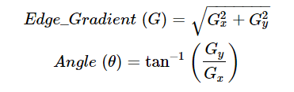

# ObjectSizeDetection

## Theory 
The fist step is to  create a function able to detect the countor of 
images.

Since edge detection is susceptible to noise in the image, first step is to remove the noise in the image with a 5x5 
Gaussian filter.

